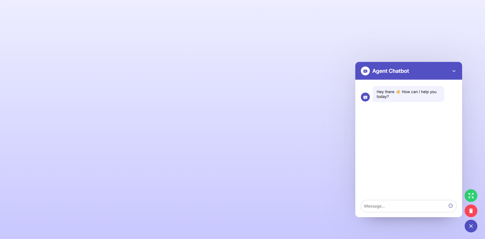
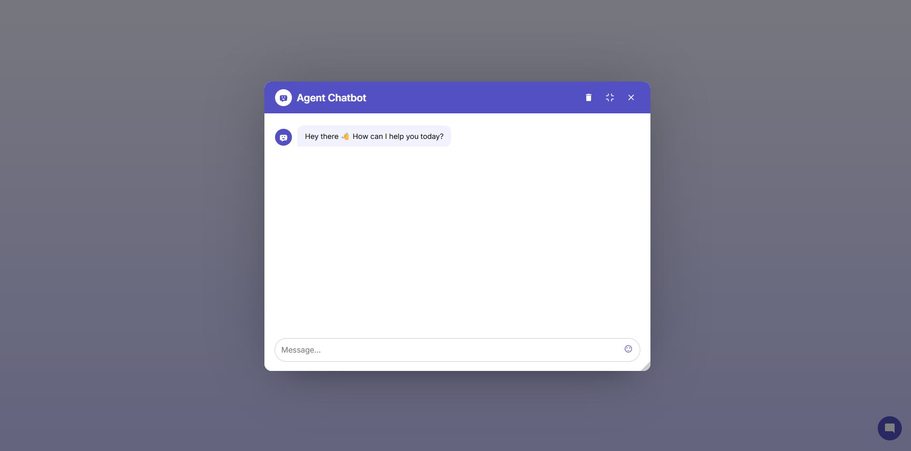

# Agent Chat UI

A React-based conversational interface for connecting a frontend app to an AI agent API and displaying chat responses.

## Purpose

This project is built to:

- Demonstrate how to connect a React app to an Agent API
- Show the message send/receive flow in a chat-based UI
- Serve as a reference implementation for integrating an Agent into other projects

## Features

- **Chat Popup** — Chat widget at the bottom-right corner, smooth open/close
- **Expand Mode** — Expand chat into a draggable, resizable modal
- **Markdown Rendering** — Bot responses render full Markdown (GFM: tables, lists, code blocks...)
- **Thinking Indicator** — "Thinking" animation while waiting for a response
- **Emoji Picker** — Insert emojis into messages
- **Clear History** — Reset the conversation to its initial state

## Project Structure
```
demo_chatbot/
├── public/
│   └── index.html              # Base HTML, loads emoji-mart from CDN
├── src/
│   ├── agentConfig.js          # Agent configuration (API Key, URL) & API service
│   ├── sharedComponents.js     # Shared UI components (Message, EmojiPicker, BotAvatar, ThinkingIndicator)
│   ├── App.js                  # Main component — Chat Popup (bottom-right widget)
│   ├── expand.js               # Expand Chat component (draggable/resizable modal)
│   ├── App.css                 # Shared stylesheet
│   └── index.js                # React entry point
├── package.json
└── README.md
```
# Installation & Run

## Install dependencies
npm install

## Start development server
npm start

## Build production
npm run build

# Agent Configuration

Open `src/agentConfig.js` and update the following values:

const API_KEY = "your-api-key-here";
const API_URL = "your-agent-api-here";

| Variable | Description |
|------|-------|
| `API_KEY` | API authentication key (`x-api-key` header) |
| `API_URL` | API endpoint URL, automatically includes the URL agent|

# API Reference

### `sendMessageToAgent(message)`

Send a message to the AI Agent API and receive a response.

**Parameters:**
| Name | Type | Description |
|-----|------|-------|
| `message` | `string` | The user's message content |

**Returns:** `Promise<{ text: string, hasError: boolean }>`

| Field | Type | Description |
|-------|------|-------|
| `text` | `string` | The Agent's response text (or raw JSON if parsing fails) |
| `hasError` | `boolean` | `true` if the Agent returned an error |

**Request format:**
```json
{
  "input_type": "chat",
  "output_type": "chat",
  "input_value": "Message content"
}
```

# Demo

## Chat UI Preview


## Chat UI Expanded
